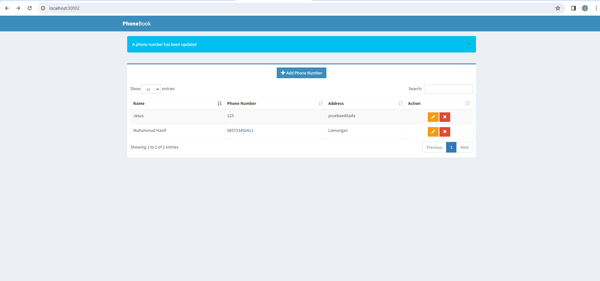

Sincronizacion con ArgoCd

Primero ejecutaremos un port forward en el server 8080 con argo cd con este comando:

kubectl port-forward svc/argocd-server -n argocd 8080:443

Y accedemos al puerto 8080 en nuestro local:

El usuario por defecto será admin y para saber la contraseña ejecutaremos este comando:

kubectl -n argocd get secret argocd-initial-admin-secret -o jsonpath="{.data.password}" | ForEach-Object { [System.Text.Encoding]::UTF8.GetString([System.Convert]::FromBase64String($_)) }

Creamos una nueva aplicacion y metemos los datos necesarios y le damos a sincronizar.

Le damos a sincronizar:

Y vamos al puerto que hemos configurado, en nuestro caso el 3002:

