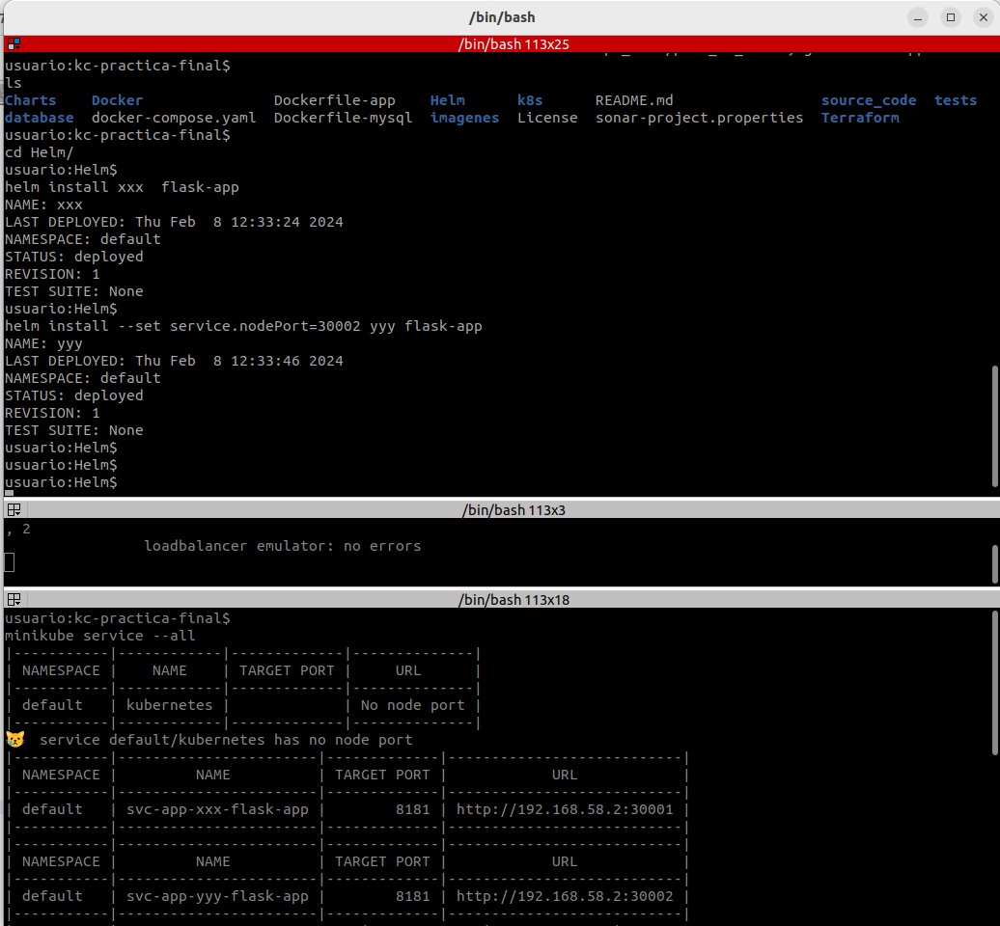

# Agenda Digital DevOps4All Helm

<a name="top"></a>
## Forma de funcionamiento

Para la práctica se utilizó **Minikube** y se ejecutaron los siguientes comandos. 
```
minikube start 
minikube addons enable metrics-server
minikube addons enable ingress
minikube tunnel 
```
Para el último comando se debe digitar el password de root y este bloqueará la consola donde se ejecute. 

## Instalación con los parámetros por defecto

Se puede ingresar a la carpeta **flask-app** para ver los valores que se pueden modificar para la instalación. En el *values.yaml*


Desde la parte externa a la carpeta **flask-app** podemos visualizar previamente los charts en formato yaml

```
#Se usa para validar lo que se va a crear
helm template flask-app

#Se usa para mostrar los posibles errores
helm template --debug flask-app

#Hace una instalación de xxx
helm install xxx  flask-app

#Para hacer otra instalación 
helm install --set service.nodePort=30002 yyy flask-app 

#Hace desinstalación de xxx
helm uninstall xxx  flask-app 

#Hace desinstalación de yyy
helm uninstall yyy  flask-app 

#Para ver los  servicios
minikube service --all

```
## Evidencias del funcionamiento CLI


## Evidencias del funcionamiento APPs


[Volver al principio](#top)
[Volver a README principal](../README.md)