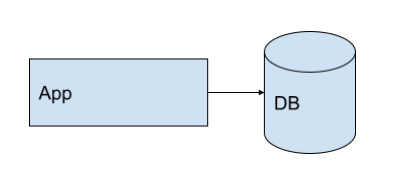
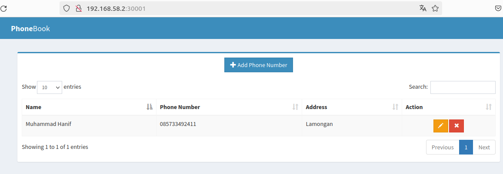
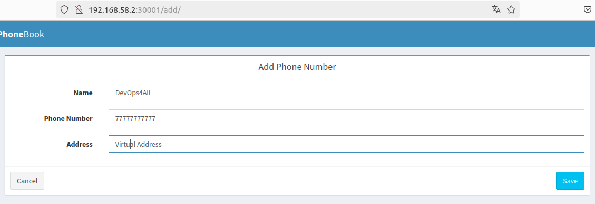
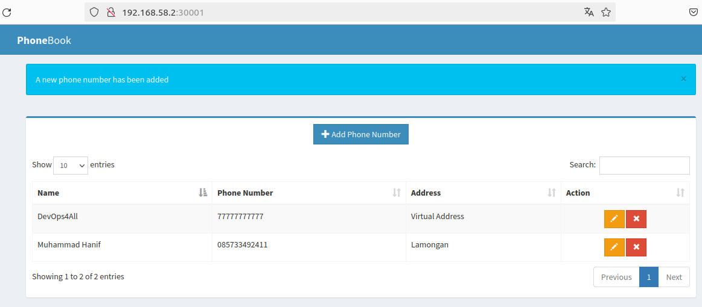

# Agenda Digital DevOps4All

## Descripción de la solución
* Se tiene una aplicación Web hecha en Python con Flask. 
* Se tiene una base de datos MySQL. 
* La App realiza operaciones de inserción y consulta sobre la base de datos.

Dicha App es una copia modificada de la aplicación encontrada
el repositorio público [Simple CRUD](https://github.com/muhammadhanif/crud-application-using-flask-and-mysql) 

## Funcionamiento
### Página de inicio

### Ingreso de Registro

### Registro Realizado

## Proceso
* 1-Crear una organizacion Github
* 2-Crear un proyecto Github
* 3-Dar permisos sobre el invitar a las personas Github
* 4-Crear el repositorio
* 5-Crear ramas
   - main
   - develop
   - feature/name
* 6-  Proteger Ramas ( Opcional )  
* 7-  Enlazar el proyecto con repositorios
   -  Crear issues
   -  Crear PR (Pull Request)
   -  Resolver conflictos
* 8- Instrumentar la Aplicación 
* 9- Creación de manifiestos YAML 
* 10-Creación de los Helm Charts
* 11- Integración Continua con Circleci
* 12- Despliegue Continuo con Argo CD 
## Requisitos
* Tener Docker instalado
* Tener Docker-Compose instalado
* Tener Kubectl instalado
* Tener Minikube instalado
* Tener Helm instalado

## Despliegue
* Para funcionamiento local en Docker: [Docker: App + MySQL](./Docker/Docker.md)
* Para funcionamiento con manifiestos YAML: [K8s: App + MySQL](./k8s/K8s.md)
* Para ver el proyecto en [Circleci](https://app.circleci.com/pipelines/github/cjcuesta/kc-practica-final)
* Para funcionamiento con Helm Chart: [Helm: App + MySQL](./Helm/Helm.md)
* Para funcionamiento con Terraform: [Terraform: AWS ](./terraform/README.md)
* Para funcionamiento con Terraform: [Terraform: GKE ](./Terraform/GKE/GKE.md)
