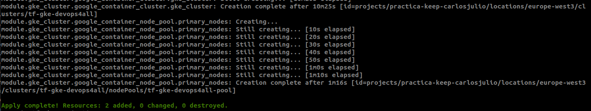
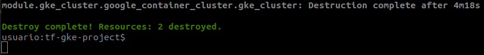

# Agenda Digital DevOps4All GKE

<a name="top"></a>
## Introducción

Para la creación del cluster se utililizó como referencia el instructivo
[Terraform — Provision Google Kubernetes Engine(GKE) Cluster](https://prashant-48386.medium.com/terraform-provision-google-kubernetes-engine-gke-cluster-c3f5c1fdae14).

Se realizaron las siguientes modificaciones al código para que funcionará. 
- En el archivo  **main.tf** Se adicionó la que no se protegiera contra el borrado el cluster. Esto para que permitiera que la instrucción *terraform destroy* lograra destruir el cluster GKE creado
- Asi mismo en el archivo  **main.tf** se comentó la propiedad *disk_size_gb* que al parecer ya no se utiliza. 
Este es el segmento de código modificado. 
```properties
resource "google_container_cluster" "gke_cluster" {
  ...
  deletion_protection      = false
  #disk_size_gb            = var.diskSize
  ....
```
- Se comentó en archivo **terraform.tfvars** la variable *diskSize*.
```properties
region="europe-west3"
clusterName="tf-gke-DevOps4All"
#diskSize=50
minNode=1
maxNode=3
machineType="e2-medium"
```
- También se comentaron las referencias a la variable *diskSize*.
  En los archivos:
  - tf-gke-project/production.tf
  - tf-gke-project//variables.tf
  - tf-gke-project/modules/gke_cluster/variables.tf

  

## Requisitos

- Cuenta en [GCP](https://accounts.google.com)
- Activación de APIS
  - [Compute Engine API](https://console.developers.google.com/apis/api/compute.googleapis.com/overview)
  - [Kubernetes Engine API](https://console.cloud.google.com/apis/api/container.googleapis.com/overview)
- [Terraform](https://developer.hashicorp.com/terraform/install) instalado
- [gcloud CLI](https://cloud.google.com/sdk/docs/install?hl=es-419) instalado
  - Realizar el apartado de ["Inicializar gcloud CLI"](https://cloud.google.com/sdk/docs/install-sdk?hl=es-419#initializing_the)
- [kubectl](https://kubernetes.io/docs/tasks/tools/) instalado  
- Crear la [cuenta de servicio](https://cloud.google.com/iam/docs/service-accounts-create?hl=es-419) con el rol de editor.
  - Cambiarle el nombre al archivo de la cuenta de servicio a **cred.json**
  - Colocar el archivo de credenciales **cred.json** en la carpeta **tf-gke-project** 

## Preparación
### Configuración Proyecto con gcloud CLI    
Se revisa en que proyecto esta gcloud
```
gcloud config get-value project 
```
Muestra todos los proyectos existentes
```
gcloud projects list
```

Se cambia al IDproyecto deseado
```
gcloud config set project <ID-PROYECTO>
```
### Parametrización
- Agregar los archivos al **.gitignore**
  ```properties
  #Archivo generado por la cuenta de servicio
  cred.json
  .terraform
  .terraform.lock.hcl
  terraform.tfstate
  terraform.tfstate.backup
  *.pem
  ```
- Modificar parámetros o variables para creación del Cluster en el archivo **terraform.tfvars**
  - Aqui se puede modificar la región donde se quiere desplegar el cluster: región
  - El nombre con que se creará el cluster: clusterName
  - El tipo de MV con las que se creará el cluster: machineType
  - El número mínimo y máximo de nodos: minNode y maxNode 
    ```properties
    region="europe-west3"
    clusterName="tf-gke-DevOps4All"
    minNode=1
    maxNode=3
    machineType="e2-medium"
    ```

## Creación del Cluster
Se ingresa a la carpeta **tf-gke-project** y se ejecutan las siguientes instrucciones.
- Para instalar dependencias e inicializar el proyecto. 
  ```
  terraform init
  ```
- Valida que la sintaxis sea correcta
  ```
  terraform validate
  ```
- Se conecta con GC y Muestra que es lo que va a hacer lo que se crear se borra y se modifica.   
  ```
  terraform plan
  ```
- Hace primero el validate, luego hace el plan muestra lo que va a realizar. Luego pregunta si se esta de acuerdo con lo que se va a realizar.  
  ```
  terraform apply
  ```
  Con el parámetro *-auto-approve* no realiza la pregunta si esta de acuerdo o no. Solo lo aplica.
  ```
  terraform apply -auto-approve
  ```

  Evidencia del cluster creado con terraform
  

  Evidencia del cluster funcionando en la Consola de Google
    

## Interacción con el Cluster
Una vez Configurado Proyecto con gcloud CLI y creado el Cluster. 
Se añade el contexto a kubectl.
```
gcloud container clusters get-credentials tf-gke-devops4all --region europe-west3
```

Para ver información del cluster
```
kubectl cluster-info 
```

Ejecución con los manifiestos YAML en la carpeta k8s con LoadBalancer
```
k apply -f cfm-init-mysql.yaml && \
k apply -f cfm-db-mysql.yaml && \
k apply -f sec-db-mysql.yaml && \
k apply -f pvc-db-mysql.yaml  && \
k apply -f svc-db-mysql.yaml && \
k apply -f dep-db-mysql.yaml && \
k apply -f cfm-app-flask.yaml && \
k apply -f svc-load-app-flask.yaml && \
k apply -f dep-app-flask.yaml 
```

Salida creació de YAMLs.


Para ver la IP-EXTERNA del servicio del la APP
```
k get svc -w 
```


# (PENDIENTE) FALTA HACER EL CHART DEL LOADBALANCER

Desde la parte externa a la carpeta **flask-app** podemos visualizar previamente los charts en formato yaml

```
#Se usa para validar lo que se va a crear
helm template flask-app

#Se usa para mostrar los posibles errores
helm template --debug flask-app

#Hace una instalación de xxx
helm install xxx  flask-app

#Hace desinstalación de xxx
helm uninstall xxx  flask-app 
```

Para ver la IP-EXTERNA del servicio del la APP
```
k get svc -w 
```
### Evidencias de la Aplicación funcionando


# Evidencias de la destrucción del cluster
```
terrafom destroy -auto-approve
```



- [Volver al principio](#top)
- [Volver a Terraform](../Terraform.md)
- [Volver a README principal](../../README.md)
