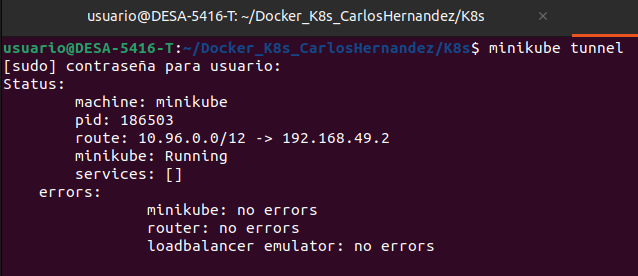
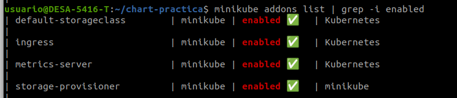

# K8s

<a name="top"></a>
## Forma de funcionamiento

Para la práctica se utilizó **Minikube** y se ejecutaron los siguientes comandos. 

```
minikube start 
```
```
minikube addons enable metrics-server
```

```
minikube addons enable ingress
```

```
minikube tunnel 
```


Para el último comando se debe digitar el password de root y este bloqueará la consola donde se ejecute. 

Podemos visualizar la activación de los addOns de Minikube
```
minikube addons list | grep -i enabled 
```



## Manifiestos. 

Para iniciar se debe igresar a la carpeta K8s donde se encuntran todos los maninifiestos. 

### Creación del configmap de inicio de la base de datos.

Se crea el configmap de inicio de la base de datos.
Se usa el archivo  **crud_flask.sql**. Que se encuentra en la carpeta  **database**.
```
k create configmap mysql-preload-data-config --from-file=crud_flask.sql --dry-run=client -o=yaml > cm-init-mysql.yaml
```

Posteriormente se modifica el archivo **mysql-deployment.yaml** para hacer
referencia al configmap creado. 

### Persistencia de la base de datos.


### Instalación de los manifiestos.

Aplica el configmap de script de inicialización
```
k apply -f cm-init-mysql.yaml
```

Aplica el configmap de variables de entorno de MySQL
```
k apply -f cm-db-mysql.yaml
```

Se codifica el password de root
```
echo -n 'root' | base64
```

Se codifica el password de la base de datos
```
echo -n 'dev' | base64
```
Las dos codificaciones anteriores deben colocarse en el archivo **sec-db-mysql.yaml**
Y luego aplicar el secret de variables de entorno MYSQL_ROOT_PASSWORD y  MYSQL_PASSWORD.
```
k apply -f sec-db-mysql.yaml
```

Aplica el PersitenVolume
```
k apply -f pv-mysql.yaml 
```

Servicio de Mysql
```
k apply -f mysql-service.yaml
```

Deployment de Mysql
```
k apply -f mysql-deployment.yaml
```

Para ver el pod de Mysql
```
k get pods 
```

Para ingresar al pod de Mysql
```
k exec -ti mysql-b74bd6b99-nvwq2 -- bash
```

Para loguearse con Mysql
```
mysql -u dev -pdev
```

Para ver las bases de datos
```
show databases;
```

Para cambiar a la base de datos creada
```
use crud_flask;
```

Para  ver las tablas
```
show tables; 
```

Para  ver los datos de la tabla
```
select * from phone_book;
```

Se aplica el servicio de la App
```
k apply -f flask-app-service.yaml
```

Se aplica el deployment de la app
```
k apply -f flask-app-deployment.yaml 
```
Para ver los  servicios
```
minikube service --all
```


[Volver al principio](#top)
[Volver a README principal](../README.md)