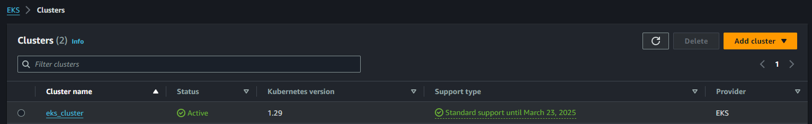
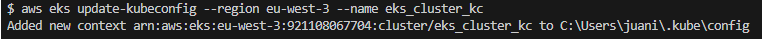
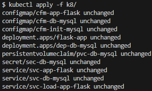
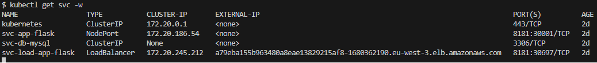
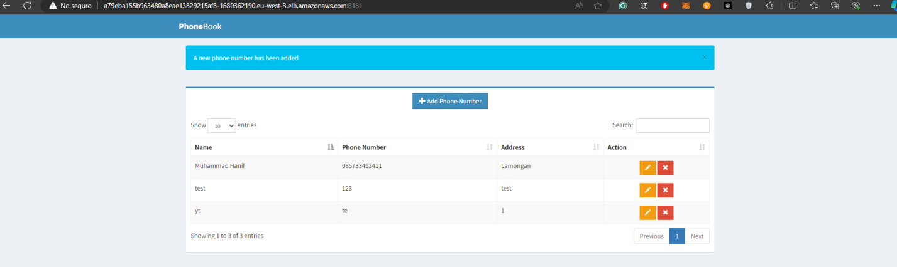

# Despliegue de servicio EKS con cluster


## Requisitos

- Contar una cuenta en AWS
- Tener instalado aws cli
- Tener instalado kubectl


## Archivos

El presente repositorio cuenta con una carpeta terraform con dos directorios
- modules: Contiene la declaración de toda la infraestructura
- root: Contiene la información para iniciar la infraestructura


## Instalación y desplieuge

En la carpeta root correr

```bash
  terraform init
```
    
El cual iniciara el despliegue de toda la infraestructura 

A continuación pasar los comandos 

```bash
  terraform plan
  terraform apply
```
Con los cuales toda la infraestructura sera arrancada en la región que inidica el archivo provider.td




Correr el comando para la conexión al cluster de eks desde la linea de comandos:
```bash
aws eks update-kubeconfig --region region-code --name my-cluster
```
```bash
aws eks update-kubeconfig --region eu-west-3 --name eks_cluster_kc
```



Retornar a la carpeta raiz y aplicar los archivos de kubernetes con el comando kubectl
```bash
kubectl apply -f k8/
```



Finalmente, despues de esperar a que el la infraestructura sea creada en el cluster, correr el comando para traer información del servicio
```bash
kubectl get svc -w
```


Observa el servicio load balancer con la ip externa, la cual se puede acceder desde un navegador apuntando al puerto 8181 para acceder a la aplicación desplegada

